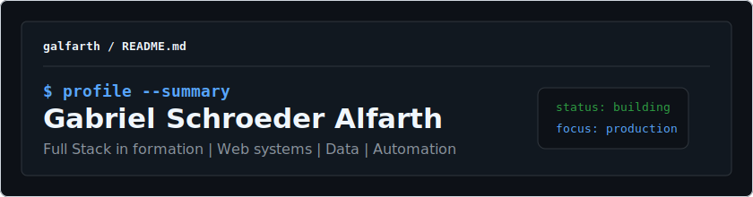

  

## about me

`full stack developer in formation` `brazil` `web systems` `data` `automation`

- Building web systems, dashboards, automations and internal tools.
- Focused on practical projects, clean interfaces and useful operational data.
- Currently improving with JavaScript, React, Python, FastAPI and Power BI.

## fav digital archives

| repository | description |
| --- | --- |
| [`sistema-carregamentos`](https://github.com/galfarth/sistema-carregamentos) | operational panel with FastAPI, Microsoft Graph and SharePoint |
| [`portfolio-gabriel-alfarth`](https://github.com/galfarth/portfolio-gabriel-alfarth) | personal portfolio with projects, resumes, languages and GitHub Pages |
| [`carregamentosemanal`](https://galfarth.github.io/carregamentosemanal/) | static dashboard with filters, weekly schedule and operational indicators |
| [`advminella`](https://github.com/galfarth/advminella) | institutional website and admin portal with Firebase |

## toolkit

| area | skills |
| --- | --- |
| front-end | responsive interfaces, components, filters, modals, forms |
| back-end | APIs, business rules, authentication, integrations, internal panels |
| data | dashboards, indicators, PostgreSQL, spreadsheets, Power BI |
| deploy | GitHub Pages, Netlify, Render, Git versioning |

## let's connect

Feel free to explore my repositories. I am open to projects and opportunities involving web development, dashboards, automation and data-driven tools.

- portfolio: [`galfarth.github.io/portfolio-gabriel-alfarth`](https://galfarth.github.io/portfolio-gabriel-alfarth/)
- linkedin: [`linkedin.com/in/gabrielalfarth`](https://www.linkedin.com/in/gabrielalfarth/)
- email: [`gabrielschroederalfarth@gmail.com`](mailto:gabrielschroederalfarth@gmail.com)
